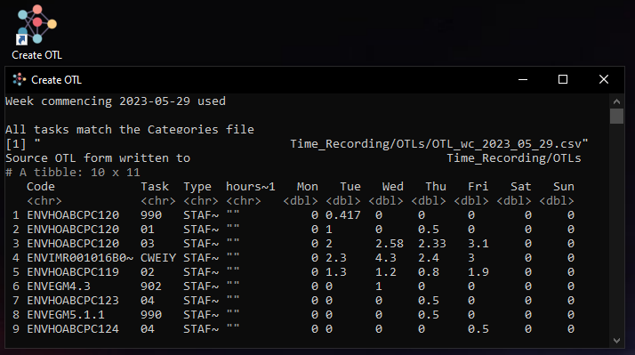

<!-- README.md is generated from README.Rmd. Please edit that file -->

# planThis 

<!-- badges: start -->

<!-- badges: end -->

The goal of planThis is to simplify time keeping in the EA. It uses
categorised outlook appointments to create time cards weighted against
free time and daily hours. Outputs are suitable for Oracle
implementation.

## Installation

You can install the development version of planThis from
[GitHub](https://github.com/) with:

``` r
# install.packages("devtools")
devtools::install_github("JonPayneEA/planThis")
```

## Example

This is a basic example which shows you how to use the tool. It requires
three documents for use;

  - A daily hours spreadsheet (*.xlsx*)  
  - Categories data (*.csv*)  
  - An exported outlook calendar (*.csv*)

### Daily hours

The daily hours needs your start time, end time and lunch hours.

Normal work days are set to `Standard`, with this 7.4 hours of work are
expected. A running total of flexi hours is calculated.

Additional options include;  
\- `Weekend` (*0 hrs*)  
\- `Bank Holiday` (*0 hrs*)  
\- `Sick` (*0 hrs*)  
\- `Sick Half` (*3.7 hrs*)  
\- `Leave` (*0 hrs*)  
\- `Leave Half` (*3.7 hrs*)  
\- `Flexi` (*7.4 hrs*)  
\- `Flexi Half` (*3.7 hrs*)


### Categories

Categories data are essential for linking appointments in outlook to a
time code.

Setting this up will be the most time consuming part of the process,
however it only need to be done once. In the below pictures the
`categories.csv` and outlook colour categories match up.

The baseline category file can be produced with

``` r
planThis::createCatagsFile(path = 'file path to save location')
```

<div class="figure" style="text-align: center">


<p class="caption">

Allignment of categories.csv and colour categories in outlook

</p>

</div>

### Outlook calendar and Power Automate

Now the `categories.csv` and colour categories are set up you will need
to organise your outlook calendar.

The best way to do this is to set up Power Automate, so that it exports
your calendar on a weekly basis.

More guidance will be coming in future on this.

<div class="figure" style="text-align: center">


<p class="caption">

Power Automate export process

</p>

</div>

## Running planThis

Following installation load the tool with:

``` r
library(planThis)
```

Set your file locations with;

``` r
catags <- 'C:/Users/jpizzle/DeskyMcDeskFace/Time/Categories_TCs.csv'
dailHours <- 'C:/Users/jpizzle/DeskyMcDeskFace/Time/Daily_hours.xlsx'
outlC <- 'C:/Users/jpizzle/DeskyMcDeskFace/Time/Calendar.xlsx'
pathOTL <- 'C:/Users/jpizzle/DeskyMcDeskFace/Time'
weekS <- '2023-05-15'
tasks <- c('Cap Skills', 'FFIDP', 'Reactive Forecasting')
weightings <- c(1, 2, 1)
```

To create the time card use the `createTC()` function. In the case we
won’t export to the OTL form, using `export = FALSE`, and will instead
print the time card data into the console.

``` r
tCard <- createTC(categories = catags,
                  daily = dailHours,
                  outCal = outlC,
                  week_start = weekS,
                  split = tasks,
                  weight = weightings,
                  pathOTL = path,
                  export = FALSE)
#> 
#> All tasks match the Categories file
print(tCard)
#> # A tibble: 10 x 11
#>    Code            Task  Type  hours~1   Mon   Tue   Wed   Thu   Fri   Sat   Sun
#>    <chr>           <chr> <chr> <chr>   <dbl> <dbl> <dbl> <dbl> <dbl> <dbl> <dbl>
#>  1 ENVHOABCPC076   03    STAF~ ""          1   2    0      0     0       0     0
#>  2 ENVIMR001016B0~ CWEIY STAF~ ""          5   2    1.3    2.6   3.4     0     0
#>  3 ENVEGM4.3       901   STAF~ ""          1   0    0      0     0       0     0
#>  4 ENVHOABCPC120   01    STAF~ ""          1   0    0      1.5   0       0     0
#>  5 ENVHOABCPC120   990   STAF~ ""          0   0.5  0      0     0       0     0
#>  6 ENVEGM5.1.1     990   STAF~ ""          0   0.5  4      0     0       0     0
#>  7 ENVHOABCPC120   03    STAF~ ""          0   1    1.68   2.2   2.4     0     0
#>  8 ENVHOABCPC119   02    STAF~ ""          0   2    1.1    1.2   1.7     0     0
#>  9 ENVHOABCPC123   04    STAF~ ""          0   0    0      0.5   0       0     0
#> 10 ENVEGM5.16      010   STAF~ ""          0   0    0      0     0.5     0     0
#> # ... with abbreviated variable name 1: hoursType
```

When `export = TRUE` your OTL form will export into the `file_path`
location of the format OTL\_*`week_start`*. In the example below the
exported file is **OTL\_2023-05-15**

``` r
tCard <- createTC(categories = catags,
                  daily = dailHours,
                  outCal = outlC,
                  week_start = weekS,
                  split = tasks,
                  weight = weightings,
                  pathOTL = path,
                  export = TRUE)
```


## Batch files

The tool can be set up as a batch file. With the automatic calendar
imports all that is required for generating an OTL form is running the
`.bat` file. Setting the `week_start = NULL`, will make the functions
use the previous calendar week starting on Monday.


